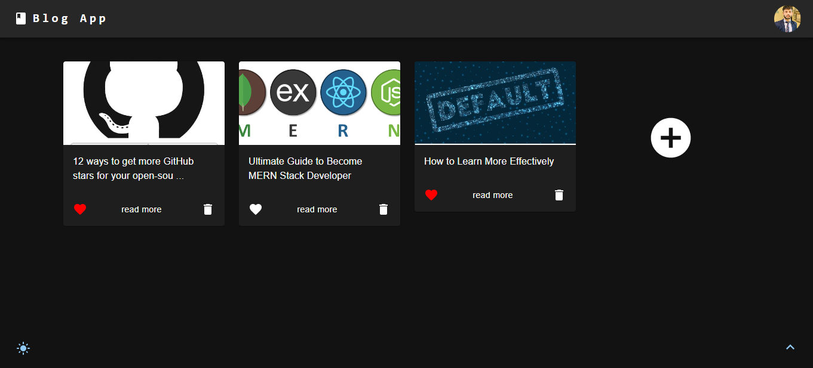
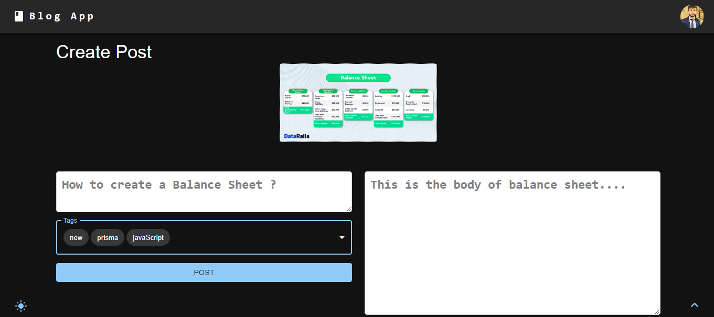
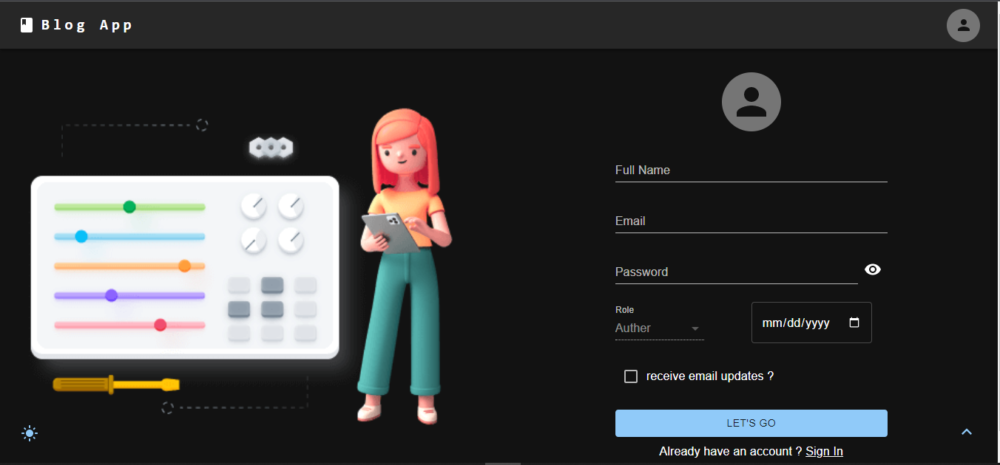
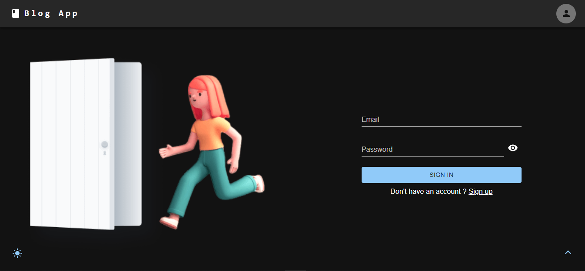
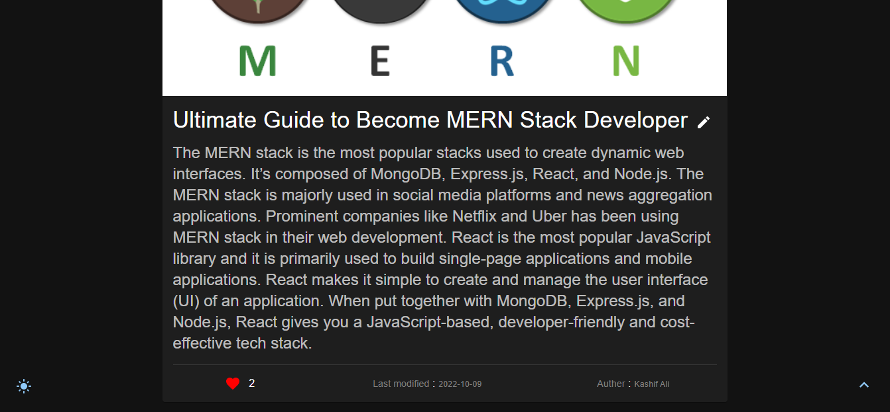

# Blog-App

An Amazing Blog App  where you can do CRUD operations on User and Blogs and also you can like the blogs.

# Live Preview
- [Live Preview](https://amazing-blog-app.herokuapp.com/)
# Features

## User Interface
- Dark theme available
- Scroll back to Top
- Dark theme available
- A SnackBar to show the status of the operation
- Fullscreen mode
- Cross platform
- Completely Responsive
## Authentication
- Admin and User Management
- Register
- LogIn
- LogOut
- Delete Account
- Update Account
- User password will be converted into encrypted password
## Blogs
- Create a new blog
- Like the Blog
- You can add related tags to the Blog
- Total number of likes get the blog
- View The Blog
- Update The Blog
- Delete The Blog
## Others 
- When Delete the User their Posts will be deleted automatically
- Images will be saved in database
- Generate Cloudinary Image link
- Protected Routes (you can't navigate to the protected routes when you are not logged in)
# Technologies
## Front End
- Material Design
- React.js
- Redux toolkit
- Redux Persistence
- Axios 
- Formik for handling forms
- Yup for Validation Schema
- React Router Dom for Navigation
## Back End
- Express.js 
- Prisma
- PostgresQL
- Cloudinary
- Multer
- bcrypt for passwords management
- Cors
- dotenv
- Prisma Client
- cookie-parser
- jsonwebtoken

# Installation
 - You need to start both servers fron-end and back-end to work properly..

```bash
  clone the blog-app
  cd blog-app
  npm install or yarn add
  npm run start-client (start the front-end server)
  npm run dev (start the back-end server)
```

## Screenshots
<h1>Home Page</h1>

<h1>Create Post</h1>

<h1>Register User</h1>

<h1>LogIn Page</h1>

<h1>View Post</h1>


## 🔗 Links

[](https://www.linkedin.com/in/kashif-ali-ba8241196/)
[](https://github.com/jaxkashif34)


## Authors

- [@jaxkashif34](https://github.com/jaxkashif34)
